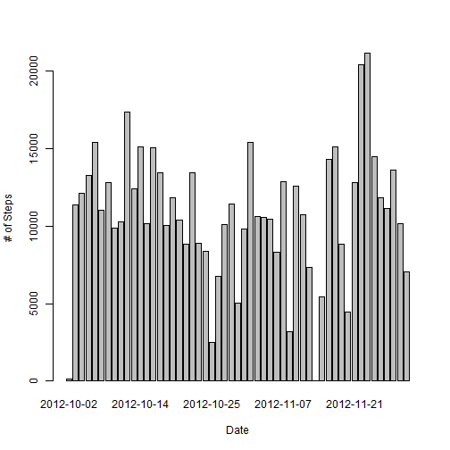
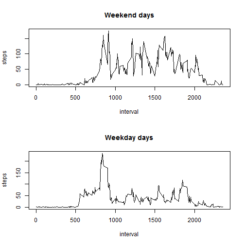

# Reproducible Research: Peer Assessment 1


## Loading and preprocessing the data
1. Load the data

```r
myData <- read.csv("activity.csv")
```


## What is mean total number of steps taken per day?
1. Make a histogram of the total number of steps taken each day

```r
steps.date <- aggregate(steps ~ date, data = myData, FUN = sum)
barplot(steps.date$steps, names.arg = steps.date$date, xlab = "Date", ylab = "# of Steps")
```

 

2. Calculate and report the ***mean*** and ***median*** total number of steps taken per day

```r
mean(steps.date$steps)
```

```
## [1] 10766
```

```r
median(steps.date$steps)
```

```
## [1] 10765
```


## What is the average daily activity pattern?
1. Make a time series plot (i.e. `type = "l"`) of the 5-minute interval (x-axis) 
and the average number of steps taken, averaged across all days (y-axis)


```r
steps.interval <- aggregate(steps ~ interval, data = myData, FUN = mean)
plot(steps.interval, type = "l")
```

 


2. Which 5-minute interval, on average across all the days in the
   dataset, contains the maximum number of steps?


```r
steps.interval$interval[which.max(steps.interval$steps)]
```

```
## [1] 835
```


## Imputing missing values
1. Calculate and report the total number of missing values in the dataset (i.e. 
the total number of rows with NAs)

```r
sum(is.na(myData[, ]))
```

```
## [1] 2304
```


2. Devise a strategy for filling in all of the missing values in the dataset. 
The strategy does not need to be sophisticated. For example, you could use the 
mean/median for that day, or the mean for that 5-minute interval, etc.

I will use the mean for each day to fill inall the missing values in the dataset.

3. Create a new dataset that is equal to the original dataset but with the 
missing data filled in.


```r
myData <- merge(myData, steps.date, by = "date", suffixes = c("", ".y"))
nas <- is.na(myData$steps)
myData$steps[nas] <- myData$steps.y[nas]
myData <- myData[, 1:3]
```


4. Make a histogram of the total number of steps taken each day and Calculate 
and report the mean and median total number of steps taken per day. 


```r
steps.date <- aggregate(steps ~ date, data = myData, FUN = sum)
barplot(steps.date$steps, names.arg = steps.date$date, xlab = "Date", ylab = "# of Steps")
```

 

```r
mean(steps.date$steps)
```

```
## [1] 10766
```

```r
median(steps.date$steps)
```

```
## [1] 10765
```


**Do these values differ from the estimates from the first part of the assignment?**
No, they don't.

**What is the impact of imputing missing data on the estimates of the total daily 
number of steps?**
From this approach, the impact is low or even none. 


## Are there differences in activity patterns between weekdays and weekends?
1. Create a new factor variable in the dataset with two levels - "weekday" and
"weekend" indicating whether a given date is a weekday or weekend day.

```r
GetDay <- function(date) {
    day <- weekdays(as.Date(date)) %in% c("Saturday", "Sunday")
}
myData$IsWeekend <- as.factor(sapply(myData$date, GetDay))
```


2. Make a panel plot containing a time series plot (i.e. type = "l") of the 
5-minute interval (x-axis) and the average number of steps taken, averaged 
across all weekday days or weekend days (y-axis). 


```r
IsWeekend <- function(boolVal) {
    if (boolVal) {
        "Weekend days"
    } else {
        "Weekday days"
    }
}
par(mfrow = c(2, 1))
for (bool in c(TRUE, FALSE)) {
    steps.bool <- aggregate(steps ~ interval, data = myData, subset = myData$IsWeekend == 
        bool, FUN = mean)
    plot(steps.bool, type = "l", main = IsWeekend(bool))
}
```

 

